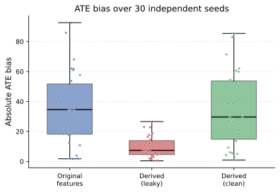
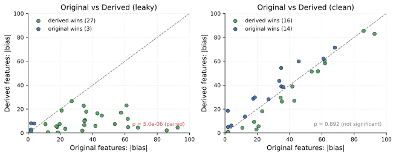
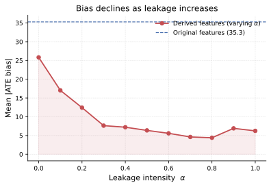
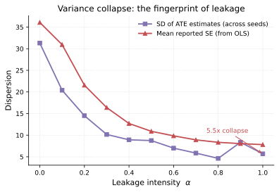

<div align="center">

# Does Feature Engineering Improve ATE Estimation in DML?

### A Controlled Diagnostic Study on Target Leakage

[](https://www.python.org/)
[](LICENSE)
[]()

> **Negative result, reported in full.** Adding six domain-derived features to a Double Machine Learning
> pipeline reduced ATE bias by **73.75%**. Under a controlled ablation over **30 independent seeds**,
> the improvement vanished completely (**−0.65%, p = 0.892**). The gain was target leakage.

[Paper draft](paper.md) · [Diagnostic checklist](#5-diagnostic-checklist) · [Reproduce](#7-reproducibility)

</div>

---

> [!NOTE]
> **Origin of this repository.** This study grew out of auditing an earlier public project,
> [`five-elements-causal-estimation`](https://github.com/zhounan111maker/five-elements-causal-estimation),
> which reported an **89.8%** reduction in ATE error. That claim turned out to be a target-leakage
> artifact. The predecessor repository is now **archived** and carries a published
> [correction notice](https://github.com/zhounan111maker/five-elements-causal-estimation/blob/main/CORRECTION.md).
> This repository is the corrected, fully reproducible version of that work.

## 1. Background

Feature engineering is routinely assumed to improve causal effect estimation. In predictive modelling this
assumption is testable: hold out data, measure performance. In causal inference it is **not**, because the
quantity of interest — the treatment effect — is never observed.

This creates an asymmetric risk. In supervised learning, target leakage produces a conspicuous failure:
training scores soar, test scores collapse. In causal inference, leakage produces no such warning. The
estimate simply gets *better* — lower bias, tighter intervals, larger apparent methodological contribution —
and there is no held-out set to contradict it.

This repository is a controlled study of that failure mode, documented using a real pipeline in which it occurred.

**The originating mistake.** On the Kaggle Bank Customer Churn dataset, we constructed five features
describing transaction behaviour, activity, credit utilisation, customer-product matching, and spending
stability. One of them was computed from the column later used as the baseline potential outcome.

```python
# main9.py (original)  —  `Total_Trans_Amt` IS the baseline outcome Y(0)
woody = (df['Total_Trans_Amt'] / (df['Total_Trans_Ct'] + 1)) * np.log1p(df['Total_Trans_Ct'])
```

We later dropped the raw outcome column from the feature matrix. **This does not help** — the information
has already been encoded into the derived feature.

---

## 2. Experimental design

All randomness is seeded and every comparison is paired: within a repetition, all three arms see
**identical** data. Any difference is therefore attributable to the feature set alone.

### Semi-synthetic data generating process

Real covariates, simulated treatment and outcome:

```
p(D=1|X) = clip(0.7·CreditLimit/max + 0.3·MonthsInactive/max, 0.2, 0.8)
Y        = Y(0) · (1 + 0.15·D)          where Y(0) = Total_Trans_Amt
tau      = E[Y(1)-Y(0)] = 0.15 · E[Y(0)]      (full sample)  =  660.61
```

### The three arms

| Arm | Covariate set |
|---|---|
| **A — Original** | 27 raw covariates |
| **B — Derived (leaky)** | Original **+** 6 derived features, `f_wood` built from `Y(0)`  (α = 1) |
| **C — Derived (clean)** | Original **+** 6 derived features, `f_wood` rebuilt without `Y(0)` (α = 0) |

Derived features are **appended, not substituted.** Substitution would confound "engineered features help"
with "fewer covariates help." Appending isolates the derived features' contribution.

### Leakage-intensity sweep

To test whether the effect is graded rather than all-or-nothing:

```
f_wood^(α) = z( (1−α)·z(f_clean) + α·z(f_leaky) )      α ∈ {0, 0.1, …, 1.0},  15 reps each
```

---

## 3. Main findings

### 3.1 The apparent breakthrough

**Table 1 — ATE estimation over 30 independent seeds. True τ = 660.61.**

| Configuration | Mean \|bias\| | SD bias | Mean θ̂ | SD θ̂ | Mean rep. SE | Wins/30 |
|---|---:|---:|---:|---:|---:|---:|
| A — Original features | 35.294 | 24.268 | 645.706 | 40.592 | 36.158 | — |
| **B — Derived (leaky)** | **9.266** | 7.193 | 654.586 | **10.148** | **7.776** | **27/30** |
| C — Derived (clean) | 35.064 | 24.519 | 645.175 | 40.331 | 35.996 | 16/30 |

| Comparison | Δ mean bias | Paired *t* | *p* |
|---|---:|---:|---:|
| B (leaky) vs A (original) | **−73.75%** | — | — |
| **C (clean) vs A (original)** | **−0.65%** | **−0.137** | **0.892** |
| B (leaky) vs C (clean) | −73.57% | −5.587 | 4.98 × 10⁻⁶ |

> **The single most important number is p = 0.892.**
> With leakage removed, adding the features changes nothing measurable. 16 wins out of 30 is a coin flip.

### 3.2 Two leakage fingerprints

- **Dispersion collapse.** SD of θ̂ falls 40.592 → 10.148, i.e. **4.00×**.
- **Reported-SE collapse.** Mean OLS standard error falls 36.158 → 7.776, i.e. **4.65×**.

The second is the more reliable tell. A better-fitting nuisance model can reduce variance, but the *reported*
standard error reflects the estimator's internal uncertainty about the causal parameter. A five-fold collapse
means the residualised outcome has lost nearly all unexplained variation — the signature of having fitted the
answer rather than the signal.

### 3.3 Dose–response

Across α = 0 → 1 the trend is unambiguous — mean \|bias\| falls 25.83 → 6.24, SD of θ̂ falls
31.31 → 5.69 (**5.50×**), reported SE falls 36.08 → 7.82 (**4.62×**) — with sampling noise visible at
individual levels under 15 repetitions (a small uptick at α = 0.9). The relationship is monotone *in trend*,
not level-wise monotone.

Two implications:

1. **Partial leakage looks like partial progress.** No single run can separate them.
2. Because the response is smooth, an experimenter can dial in almost any headline improvement figure.
   This is exactly why implausibly clean numbers deserve scrutiny.

> **Cautionary note.** This sweep uses a disjoint seed set ({1000…1014}) and returns mean bias 25.83 at α = 0,
> versus 35.06 for the nominally identical clean arm in §3.1 (seeds {0…29}). A ~26% gap between two honest
> replications of the *same* configuration is itself the strongest argument here for repetition: run either arm
> once and you could report almost any number — without fabricating anything.

### 3.4 A second, independent error: the ground truth itself

**Table 2 — Defining "the truth" correctly (n = 10,127).**

| Quantity | Value |
|---|---:|
| E[Y(0)], full sample | 4,404.09 |
| E[Y(0) \| D = 0] | 4,248.48 |
| E[Y(0) \| D = 1] | 4,734.99 |
| **τ (correct) = 0.15 · E[Y(0)]** | **660.61** |
| 0.15 · E[Y(0)\|D=0] — control-mean error | 637.27 (−3.53%) |
| E[Y\|D=1] − E[Y\|D=0] — naive difference | 1,196.75 (**+81.16%**) |

The treatment arm's baseline outcome is **11.45% higher** than the control arm, so the two means are not
interchangeable. Worse: adopting the naive difference-in-means as "theoretical truth" — which the original
pipeline did — inflates the target by **81.16%**, and thereby rewards estimators that remove *less* confounding.

---

## 4. Repository layout

```
dml-target-leakage-diagnosis/
├── paper.md                   # manuscript
├── notebooks/
│   └── leakage_demo.ipynb     # 30-second live demo for interviews / talks
├── figures_paper/             # PDF (paper) + PNG (slides) + SVG (GitHub-rendered)
├── src/
│   ├── dgp.py                 # semi-synthetic DGP + three "ground truth" definitions
│   ├── features.py            # derivation with a controllable leakage channel (alpha)
│   ├── dml.py                 # DML estimator (2-fold cross-fitting + LightGBM)
│   └── paper_experiments.py   # regenerates every number and figure
├── results/
│   ├── main_results.csv       # 30-seed raw output
│   ├── sweep_results.csv      # alpha-sweep raw output
│   └── paper_tables.json      # all reported values, machine-readable
├── data/
│   └── BankChurners.csv       # Kaggle Bank Customer Churn (see data/README.md)
├── requirements.txt
├── LICENSE
└── README.md
```

### Figures

| | |
|---|---|
|  |  |
| *Fig 1 — bias over 30 seeds. Leaky (red) collapses; clean (green) is indistinguishable from original (blue).* | *Fig 2 — per-seed win/loss. Clean features win 16/30: a coin flip.* |
|  |  |
| *Fig 3 — bias declines with leakage intensity α.* | *Fig 4 — the fingerprint: 5.5× dispersion collapse.* |

---

## 5. Diagnostic checklist

The practical output of this study. Ten checks, each traceable to a specific failure documented above.

**Feature construction**

1. **Trace every derived feature to its source columns.** If any feature's ancestry includes the outcome,
   that feature is contaminated — whether or not the outcome column survives into the final matrix.
2. **Removing the raw outcome column is not decontamination.** Audit the computation graph, not the column list.
3. **Treat the treatment variable as privileged.** Anything computed from *D*, including post-treatment
   aggregates, biases effect estimates. In this pipeline's e-commerce extension, a discount feature was
   computed directly from the coupon indicator.

**Reading results**

4. **Distrust simultaneous bias *and* variance gains.** Large drops in reported standard errors are a stronger
   warning than drops in bias alone.
5. **Strip leak-prone features and re-run before believing any headline number.** One line of code was worth
   73.75% here.
6. **Repeat over independent randomisation draws,** not only CV folds. A 5-fold split shares one realised
   dataset and does not measure estimator sampling variability.

**Evaluation hygiene**

7. **Fix the ground-truth formula before running anything.** Here τ = 0.15·E[Y(0)] over the **full** sample.
8. **Never evaluate against the naive difference-in-means.** That is the quantity the estimator exists to correct.
9. **Make ablations genuinely ablative.** A single-arm "feature importance" analysis supports no conclusion.
   Every ablation needs at least two arms, and thresholds must be fixed *before* seeing results.
10. **Report negative results.** "These features did not help" is a real, durable, publishable finding.
    A number that disappears under controlled conditions is not.

---

## 6. Limitations

The scope of these claims is deliberately narrow.

- **One dataset (BankChurners), one DGP, one homogeneous multiplicative effect.** Behaviour under effect
  heterogeneity is untested.
- **The dispersion-collapse signal is a heuristic, not a test.** We have no calibrated threshold, no false-positive
  rate, and no asymptotic justification. A genuinely powerful feature set could also reduce variance.
- **One learner (LightGBM), one DML variant (2-fold).** Larger fold counts, alternative learners, and
  doubly-robust constructions are untested.
- **No comparison against `EconML` / `CausalML`.** We kept the estimator minimal to isolate the feature effect;
  library-level safeguards may change how leakage manifests.
- **The clean variant is one choice among many.** Results mean "this particular semantic notion, once
  decontaminated, adds nothing here" — not that feature engineering is unhelpful in general.

---

## 7. Reproducibility

Every number in the paper and this README comes from one script. No manual steps.

```bash
pip install -r requirements.txt
python src/paper_experiments.py
```

The script prints Tables 1–2, writes all four figures as PDF and 300-dpi PNG, and saves raw results to
`results/`. Finished fits are cached, so figures regenerate without re-running the models.

All randomness is seeded (`random_state=42` within estimators; independent seeds across repetitions).

### Minimal reproduction of the headline result

```python
from src.dgp import simulate_treatment, simulate_outcome, true_ate_full
from src.features import build_wuxing
from sklearn.model_selection import train_test_split

rng = np.random.RandomState(0)
D   = simulate_treatment(rng)
y   = simulate_outcome(D)
tau = true_ate_full(df_encoded['Total_Trans_Amt'])

Xtr, Xte, Dtr, Dte, ytr, yte = train_test_split(X_all, D, y, test_size=0.2, random_state=0)
y0_tr = df_encoded.loc[Xtr.index, 'Total_Trans_Amt']

ate_leaky = dml(pd.concat([Xtr, build_wuxing(Xtr, y0_tr, alpha=1.0)[FEATURES]], axis=1), Dtr, ytr)
ate_clean = dml(pd.concat([Xtr, build_wuxing(Xtr, y0_tr, alpha=0.0)[FEATURES]], axis=1), Dtr, ytr)
# nothing changes between the two calls except the leakage channel alpha
```

---

## 8. Provenance

This repository replaces an earlier project that claimed a **89.8% ATE bias reduction** from "five-element"
derived features. That claim does not survive controlled testing and has been withdrawn.

The negative result supersedes it. We consider the replacement more valuable: it documents a failure mode
costs money in production causal pipelines, supplies a reproducible diagnostic, and states its own limits.

Audit trail, including the original (faulty) pipeline and the step-by-step diagnostic, is preserved in
[this commit history]() for transparency.

---

## 9. Citation

```bibtex
@misc{zhou2026targetleakage,
  author       = {Nan Zhou},
  title        = {Does Feature Engineering Improve ATE Estimation in DML?
                  A Controlled Diagnostic Study on Target Leakage},
  year         = {2026},
  howpublished = {Preprint / GitHub repository},
  note         = {Negative result; reproducible end to end}
}
```

---

## License

MIT. See [LICENSE](LICENSE).
